# Expense Tracking

A personal expense tracker where the primary input is **paste free text and let an LLM
structure it**. Built mobile-first for one thumb on an iPhone, in Indonesian, in rupiah.

Live at **[expensetracking.online](https://expensetracking.online)** · v0.2.0

```
paste free text  ──►  POST /api/parse (GLM-5.2)  ──►  editable review table
                                                            │
                                        attach photos ──────┤
                                                            ▼
                                                   createExpense() ──► /e/[id]
                                                            │
                                     /m/[month] · /stats ◄──┴──► /s/[token] · /f/[token]
```

Paste this:

```
bakar duit tuesday - 18/8/2026
roti buaya 38500
ayam sambal hitam 45k
perumahan laddaland 49k
kungfu soccer 49k
fan fries plaza blok m 58850
pak gembus 26k
```

…and get back the title `bakar duit tuesday`, the date `2026-08-18`, six categorised items
and a total of `Rp 266.350`, in an editable table you can fix with one tap before saving.

<p align="center">
  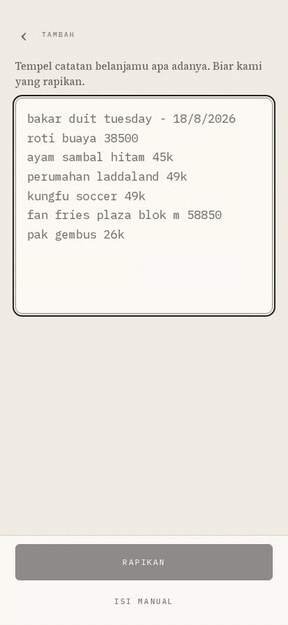
</p>

<p align="center"><em>Real capture: a real GLM-5.2 round trip against the fixture corpus, not a mockup.</em></p>

---

## Demo

Everything below is captured from the running app at 414×896 — the iPhone XS Max the design
targets — with seeded fixture data. This is the v0.2.0 design: flat, loud, graphic. One
grotesque at five weights, red as the one primary action, yellow as the highlighter, cutout
art as the wallpaper, and every card a sheet of frosted glass over it.

<table>
<tr>
<td width="33%" align="center">
  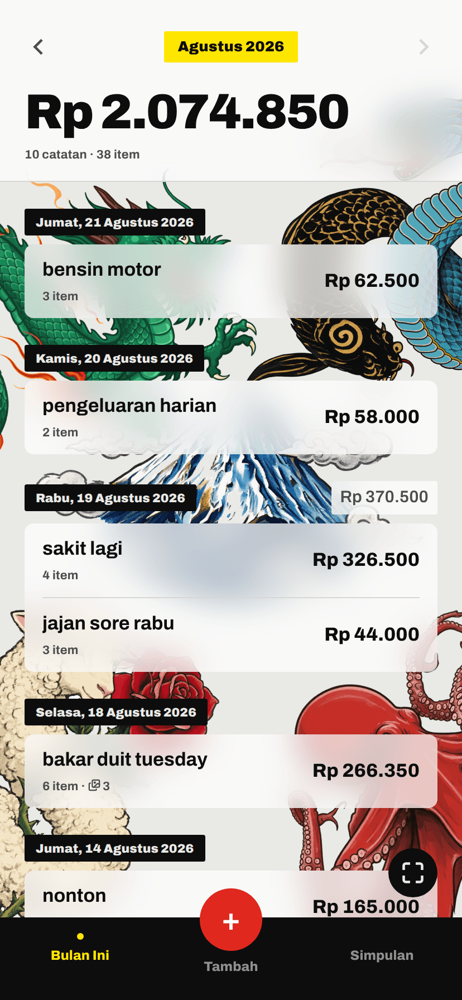
  <br><strong>The month</strong><br>
  <sub>Total in the header, groups sub-grouped<br>by day, newest first. A day total only<br>when the day holds more than one.</sub>
</td>
<td width="33%" align="center">
  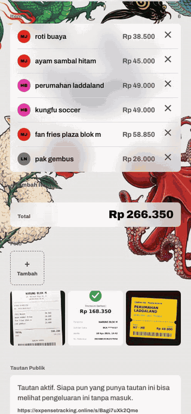
  <br><strong>Fix a category</strong><br>
  <sub>Row → bottom sheet → 2-col picker.<br>The LLM guesses; you override in one tap.</sub>
</td>
<td width="33%" align="center">
  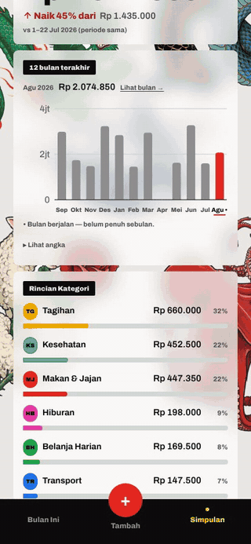
  <br><strong>Twelve months</strong><br>
  <sub>Tap a band, the readout follows.<br>April is empty on purpose — zero months<br>are drawn, not closed.</sub>
</td>
</tr>
<tr>
<td width="33%" align="center">
  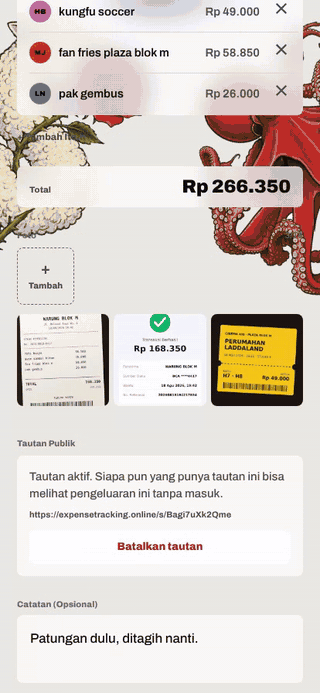
  <br><strong>The photo viewer</strong><br>
  <sub>Wrap-around swipe, and four controls:<br>close, save, share, delete.</sub>
</td>
<td width="33%" align="center">
  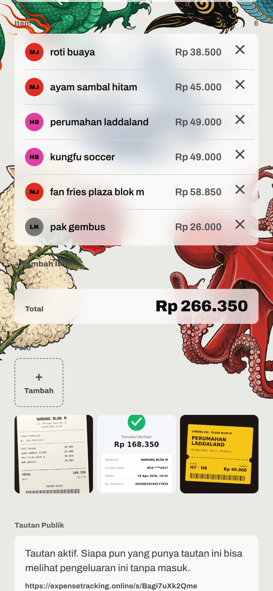
  <br><strong>Detail</strong><br>
  <sub><code>/e/[id]</code> — everything inline-editable,<br>photos and the share link at the foot.</sub>
</td>
<td width="33%" align="center">
  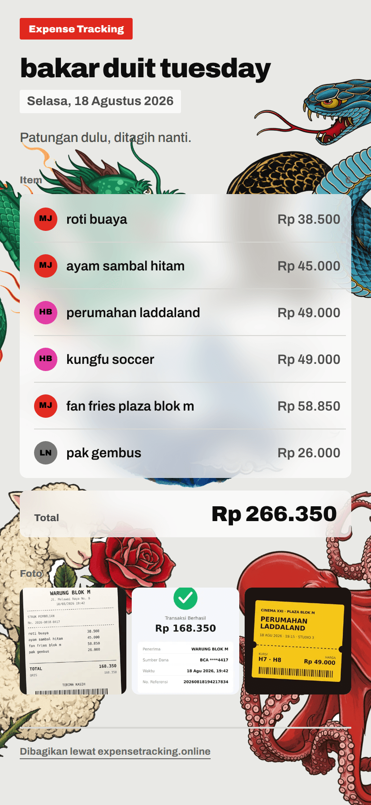
  <br><strong>Shared, read-only</strong><br>
  <sub><code>/s/[token]</code> — no login. Note the<br>absence: no raw text, no edit, no identity.</sub>
</td>
</tr>
<tr>
<td width="33%" align="center">
  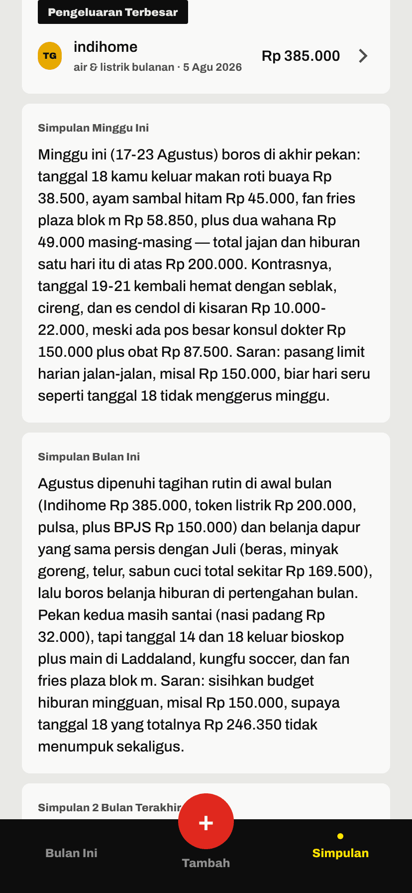
  <br><strong>Simpulan</strong><br>
  <sub>Three LLM-written paragraphs, stamped<br>on write and generated on read.</sub>
</td>
<td width="33%" align="center">
  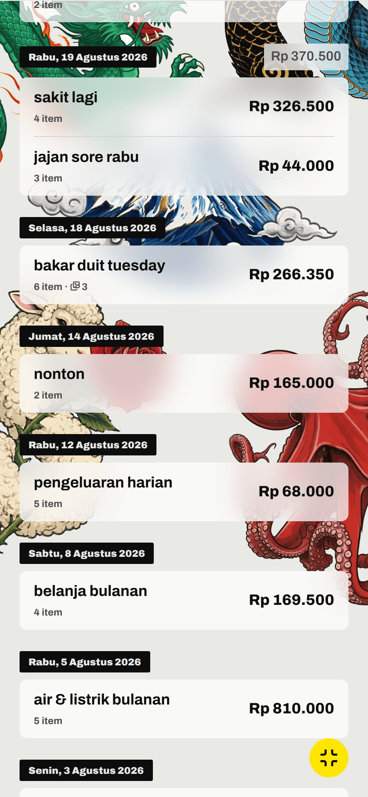
  <br><strong>Fullscreen month</strong><br>
  <sub>Header up, tab bar down, list over<br>the art. Sticky across restarts.</sub>
</td>
<td width="33%" align="center">
  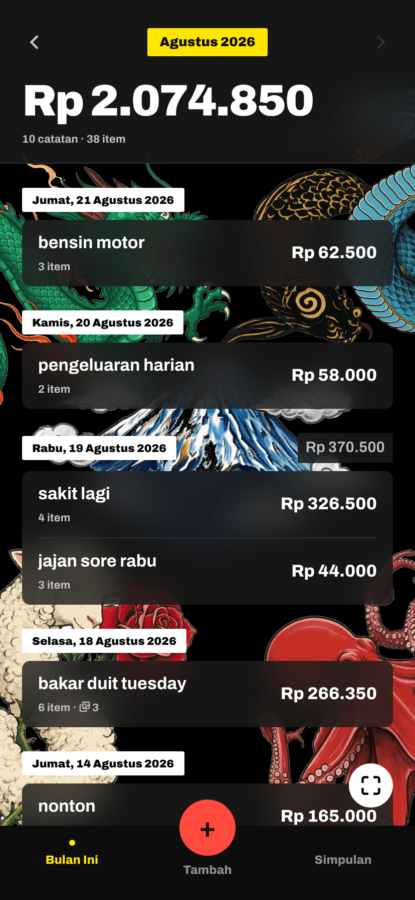
  <br><strong>Dark</strong><br>
  <sub>From <code>prefers-color-scheme</code>.<br>There is no toggle, on purpose.</sub>
</td>
</tr>
</table>

<details>
<summary>Sign-in, the parsed review table, the category picker, the viewer and the full Simpulan screen</summary>
<p align="center">
  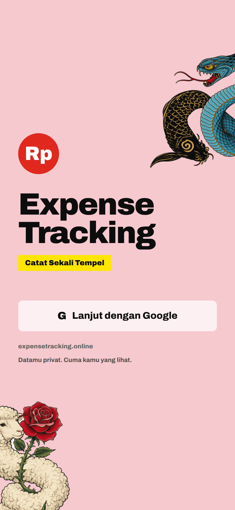
  &nbsp;
  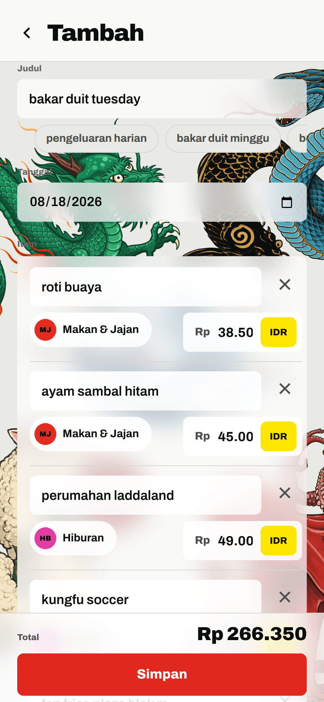
  &nbsp;
  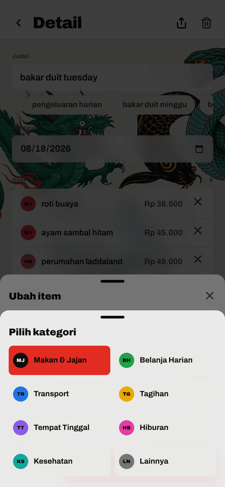
</p>
<p align="center">
  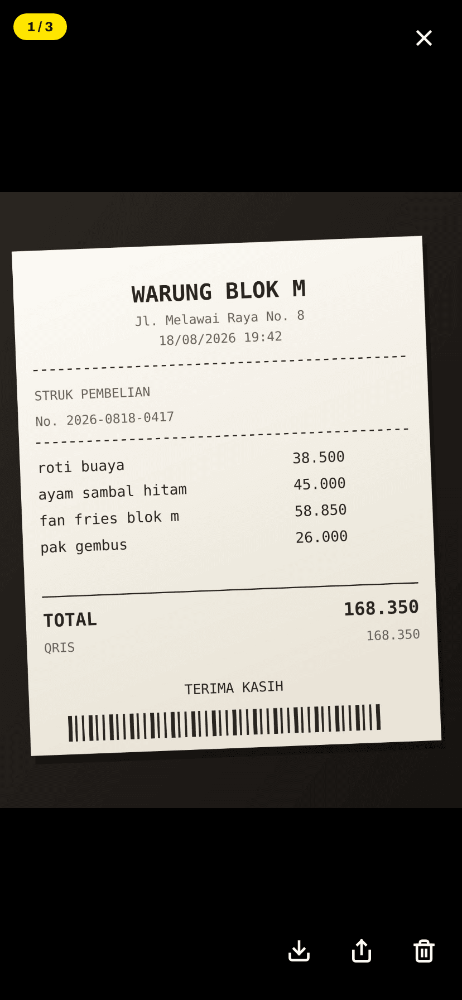
  &nbsp;
  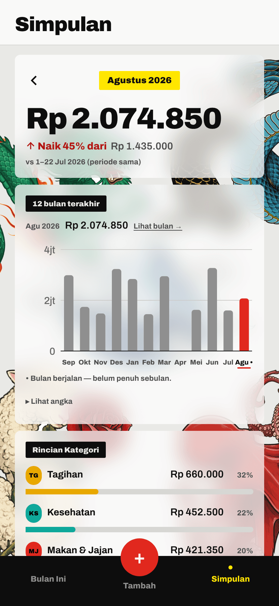
</p>
</details>

---

## What it does

- **Paste → parse.** One textarea, one *Rapikan* button. GLM-5.2 handles Indonesian money
  notation (`45k`, `45rb`, `1,5jt`, `Rp 38.500` where `.` is a thousands separator),
  `DD/MM/YYYY` dates, day names, title extraction and per-item categorisation.
- **Never hard-blocked.** Zod-validate the model's tool output → one repair round trip → a
  deterministic regex fallback parser. A 25 s timeout or an LLM outage degrades to the
  fallback rather than losing the paste. Drafts also survive a mis-tap via `localStorage`.
- **Judul presets.** Seven title chips — `pengeluaran harian` first — ordered by how often
  they are tapped rather than alphabetically, because only ~2.5 fit before the scroll edge
  on a 414 px screen.
- **Photos as opaque attachments.** Food, tickets, BCA QRIS screenshots. Compressed
  client-side to ≤1600 px / ~300 KB / JPEG q0.8 (EXIF stripped) and uploaded straight to
  Vercel Blob, so the 4.5 MB serverless body limit never comes into play. The viewer pages
  with native scroll-snap, wraps around at both ends, and carries four controls: close,
  save to Photos, share, delete.
- **Monthly rollups.** `/m/[month]` lists groups newest-first, sub-grouped by day, with the
  month total in the header, and collapses to a fullscreen list on request. `/stats` gives
  a 12-month bar chart, a month-over-month delta that is honest about the in-progress month,
  a category bar list and the biggest-single-expense callout — all aggregated in SQL.
- **Simpulan.** Three model-written Indonesian paragraphs — this week, this month, the last
  two months — below the numbers. Stamped on write and generated on read, so the save path
  pays nothing and five rapid edits collapse into one call. No fallback, deliberately: a
  regex can approximate a parse, nothing approximates prose.
- **Two kinds of read-only link.** A whole group at `/s/<token>`, or a single photo at
  `/f/<token>` — both `nanoid(12)`, ~71 bits, no login, no indexing, no caching, revocable
  by deleting the row. Sending someone a receipt should not also publish what you spent.
- **Eight categories**, each with an Indonesian label and a two-letter mono code —
  `MJ` Makan & Jajan, `BH` Belanja Harian, `TR` Transport, `TG` Tagihan, `TT` Tempat
  Tinggal, `HB` Hiburan, `KS` Kesehatan, `LN` Lainnya. Exactly eight, so the picker fits a
  2×4 tap grid in a bottom sheet.

**Not** in v0.2.0: budgets, recurring expenses, multi-currency, export, receipt OCR,
search, tags beyond the eight categories, household accounts, offline writes, push
notifications, editing on the shared page.

---

## Stack

| Layer | Choice |
|---|---|
| Framework | Next.js 16.3.1 App Router, RSC, Server Actions, Node runtime everywhere |
| UI | React 19.2.8, Tailwind CSS v4 (CSS-first `@theme`), Recharts 3.10, lucide-react 1.33 |
| Type | Archivo (variable, 400–900) via `next/font/google`, self-hosted at build time |
| Auth | Auth.js v5 (`next-auth@5.0.0-beta.32`), Google provider only, JWT sessions + Drizzle adapter |
| Database | Neon Postgres via `@neondatabase/serverless`, Drizzle ORM 0.45 |
| Files | Vercel Blob client uploads |
| LLM | GLM-5.2 through z.ai's Anthropic-compatible endpoint, via `@anthropic-ai/sdk` |
| Validation | Zod 4 |
| Tests | Vitest 4 |
| CI | GitHub Actions — lint, typecheck, test, `db:check`, build, `format:check` |
| Host | Vercel Hobby, region `sin1` |

> **On the LLM SDK.** z.ai exposes an *Anthropic-compatible* endpoint, so
> `@anthropic-ai/sdk` is the right client — constructed with `baseURL` + `apiKey`
> overrides. GLM-5.2 is **not** a Claude model: never send `thinking`, `output_config`,
> `effort`, `speed` or any `betas`. Structured output comes from **tool use with a single
> forced tool**, which is the portable mechanism across Anthropic-compatible servers.

> **On the icon set.** `components/ui/Icon.tsx` exports **finished** components and is the
> only module allowed to name `lucide-react` — enforced by ESLint and
> `tests/icon.contract.test.ts`. A generic adapter would have left the package legal at
> every call site, and once it is, `<Trash2 className="size-5" />` is less typing than the
> sanctioned path and renders fine. The 2.5-stroke / square-cap / mitred-join argument is
> now props on every glyph rather than a comment remembered in three files.

---

## Getting started

Requires **Node ≥ 24** (`.nvmrc` pins it), a Neon project, a Google OAuth client and a
z.ai API key.

```bash
npm install
cp .env.example .env.local     # then fill in every blank
npm run db:migrate             # apply drizzle/ to Neon (uses the UNPOOLED URL)
npm run dev                    # http://localhost:3000
```

Register `http://localhost:3000/api/auth/callback/google` as an authorised redirect URI on
the Google OAuth client, or sign-in will fail three redirects later with an opaque error.

### Environment

Every variable is **server-only**. None may ever be prefixed `NEXT_PUBLIC_` — that prefix
inlines the value into the client bundle. `lib/env.ts` validates them with Zod at import
time, so a missing value is a loud crash with a readable message, never a silent
`undefined`.

| Variable | Notes |
|---|---|
| `LLM_API_KEY`, `LLM_BASE_URL`, `LLM_MODEL` | `LLM_BASE_URL` takes no trailing slash and no `/v1` suffix — the SDK appends `/v1/messages` itself, and a doubled `/v1` 404s in a way that reads like an auth failure |
| `DATABASE_URL` | **Pooled** Neon string (host contains `-pooler`). Runtime only |
| `DATABASE_URL_UNPOOLED` | **Direct** Neon string. `drizzle-kit` migrate/studio only; migrating through the pooler fails confusingly |
| `AUTH_SECRET` | `openssl rand -base64 32` |
| `AUTH_GOOGLE_ID`, `AUTH_GOOGLE_SECRET` | Google Cloud Console OAuth 2.0 client |
| `AUTH_URL` | Production only. Auth.js infers the origin locally and on preview. It is also the first answer `lib/share/origin.ts` takes, so a share link minted on a preview still points at production |
| `BLOB_READ_WRITE_TOKEN` | Auto-injected by Vercel; locally use `vercel env pull .env.local` |

Every rule in that schema is a **shape** rule — non-empty, a `postgres` prefix, a parseable
URL. None of them dials anything, which is why CI can build the app with dummies and needs
no secrets at all.

### Scripts

```bash
npm run dev            # next dev (predev copies the compression worker into public/vendor/)
npm run build          # next build (Turbopack; no linting — Next 16 dropped that)
npm run typecheck      # next typegen && tsc --noEmit
npm run lint           # eslint          (lint:fix to autofix)
npm run format         # prettier        (format:check in CI — lint does NOT check formatting)

npm test               # vitest run — unit suite, no network, no database
npm run test:int       # integration suite against a real Neon database (opt-in)
npm run test:live      # hits the real GLM-5.2 endpoint — parser corpus + insights (costs money)

npm run db:generate    # generate a migration from lib/db/schema.ts
npm run db:migrate     # apply migrations
npm run db:check       # verify the generated migrations are consistent (part of CI)
npm run db:studio      # drizzle studio
npm run db:smoke       # connection smoke test
npm run blob:usage     # report blob storage usage    (blob:sweep --delete to reap orphans)
npm run icons:generate # regenerate PWA icons from public/brand/mark.svg
```

Plus the mechanical gates, kept in the repo because every one of these fails *silently* —
Tailwind emits nothing for a class it cannot resolve, and a sub-17 px input re-introduces a
Safari zoom that tapping away does not undo:

```bash
bash scripts/f05-audit.sh          # /new
bash scripts/f07-audit.sh          # /m/[month] and /e/[id]
bash scripts/f08-audit.sh          # /stats bundle, palette and honesty checks
bash scripts/f09-audit.sh          # is the public share page actually public-safe
python3 scripts/palette-check.py   # WCAG contrast + categorical separation
python3 scripts/glass-backdrop.py  # contrast of every glass surface over the real wallpaper
node scripts/install-art.mjs       # re-cut public/art/ from the plated originals
```

`/dev/ui` is a kitchen-sink page rendering every primitive in both themes at 414×896. It
404s in production.

---

## Architecture

```
app/
  (bare)/          # no tab bar: /, /new, /e/[id], /s/[token], /f/[token]
  (shell)/         # tab bar via AppShell: /m/[month], /stats, /dev/ui
  actions/         # every mutation — expenses, items, photos, share, photoShare
  api/             # parse, photos/upload, auth/[...nextauth], health
components/        # ui/ primitives (incl. Icon.tsx), photos/, share/, auth/, fullscreen/
lib/
  db/              # schema, client, queries, insights (the userId-scoping invariant lives here)
  llm/             # client, prompt, parseExpense, fallbackParse, insightPrompt, fixture corpus
  photos/          # compression, pathname, carousel, boundary types
  insights/ stats/ share/ auth/ scroll/ hooks/ blob/ schema/
  categories.ts format.ts env.ts fullscreen.ts titlePresets.ts cn.ts id.ts
drizzle/           # generated migrations — never hand-edited
docs/              # roadmap, reconciliation record, twelve feature plans, design integration
tests/             # cross-cutting suites; feature suites are co-located in __tests__/
```

### Routes

| Path | Auth | Purpose |
|---|:--:|---|
| `/` | — | Signed out: landing + Google button. Signed in: redirect to `/m/<current month>` |
| `/new` | ✅ | Paste → parse → review → photos → save |
| `/m/[month]` | ✅ | `YYYY-MM`. Month total, per-day grouped list, prev/next month, fullscreen toggle |
| `/e/[id]` | ✅ | Group detail: inline-editable items, photo gallery, share, delete |
| `/stats` | ✅ | 12-month chart, category bar list, delta, biggest expense, Simpulan |
| `/s/[token]` | ❌ | Public read-only group view, `noindex`, uncacheable |
| `/f/[token]` | ❌ | Public single-photo view. Same headers, narrower projection |
| `POST /api/parse` | ✅ | `{ rawText, todayISO }` → `ParsedExpense`. 8 000-char cap, 10 req/min burst limit |
| `POST /api/photos/upload` | ✅ | Vercel Blob `handleUpload` callback |
| `GET /api/health` | ❌ | Liveness probe. Deliberately minimal payload: `{ ok, db, commit }` |

The bottom tab bar has three destinations — **Bulan Ini**, **Tambah** (centre, raised) and
**Simpulan** — and is rendered only by the `(shell)` group. A detail view is a pushed view
with a back chevron, not a tab destination; `/new` ends in a full-width *Simpan* exactly
where the bar would otherwise sit. `/stats` kept its path when `Statistik` was renamed.

Fullscreen month mode is a **cookie**, not `localStorage`: the preference decides whether
the header is on screen at first paint, and `localStorage` can only be read after
hydration, so the header would paint full height and collapse a frame later. It is gated on
the pathname — the tab bar's layout is shared with `/stats`, and honouring the preference
group-wide would hide the navigation there with no button anywhere to restore it.

### Data model

`expense_groups` → `expense_items` / `expense_photos` / `share_links`, all cascading from
the group, and the group cascading from the Auth.js `users` row. `photo_share_links`
cascades from a photo — so revoking a photo link **is** deleting the photo, an accepted
cost. `expense_insights` is one row per user, not one per section: all three summaries come
from a single call over a single window and go stale together.

Amounts are **whole rupiah** stored as `bigint` (D5: no cents, no FX). Dates are `date`,
not timestamps — day-granular, fixed to `Asia/Jakarta` (D9, D10). Group totals are always
computed with SQL `SUM`, never denormalised onto a column (D7), so there is nothing to
drift or invalidate. Revoking a share is `DELETE FROM share_links`; re-sharing mints a
fresh token, and a UNIQUE constraint on `group_id` keeps it to one live link per group —
`photo_share_links` is shape-for-shape identical, including that index, so a second tap of
the share icon copies the *same* url.

Insight freshness is two keys, because neither subsumes the other: `dataKey`
(`max(updated_at)` **and** the row count, since deleting a group below the max leaves the
max untouched while the data changed) and `scopeKey` (Jakarta ISO week and month, for
Monday morning when nothing changed but "Simpulan Minggu Ini" is now about last week).

### Mutations

Every mutation is a **Server Action** in `app/actions/`. Route Handlers exist only for the
three cases that cannot be actions: `/api/parse`, `/api/photos/upload`, and the Auth.js
handler.

Two constraints worth knowing before adding one:

- **No interactive transactions.** The `neon-http` driver has no `db.transaction()`.
  Multi-statement atomic writes (`createExpense`, `createShareLink`) use `db.batch([...])`,
  which Neon runs as one transaction in one HTTP request.
- **Photo rows cannot precede their group.** `expense_photos.group_id` is `NOT NULL` with an
  FK, so `createExpense` takes staged `photos: NewPhotoInput[]` and inserts group + items +
  photos in that one batch. Bytes upload while the user is still editing the table.

---

## The one security invariant

**Every Server Action opens with `const userId = await requireUserId()`, and every query is
filtered by that `userId` — including nested ones.** An item update must reach back to
`expense_groups.user_id` to prove ownership. `lib/db/queries.ts` owns that primitive and
exports the correlated `EXISTS` predicates (`itemOwnedBy`, `photoOwnedBy`,
`shareLinkOwnedBy`) plus the ownership anchors; callers **import, never re-declare** them,
because the failure mode of a second copy is silent — the day one is hardened, the other is
not.

`NotFoundError` deliberately cannot distinguish "does not exist" from "belongs to someone
else". Distinguishing them would be an ownership oracle for enumerating other users' ids.

On the two public routes the **projection is the boundary**. `getPhotoByShareToken` returns
three columns and there is no second gate behind it, so `/f/<token>` cannot leak the
group's title, items or amounts even if the page were rewritten carelessly. The share
components' props are what public-safety is asserted against in
`tests/share.bundle.test.ts`.

**`proxy.ts` is not the security boundary.** Next.js routes Server Actions as POST requests
to the page they live on, so a proxy matcher that skips a path also skips its actions —
and a refactor that moves an action to another route silently removes that coverage.
`proxy.ts` is a UX redirect that sends signed-out humans to the sign-in page with a `next`
param instead of a flash of empty chrome. It uses a **positive** matcher
(`/new`, `/m/:path*`, `/e/:path*`, `/stats`) so `/s/:token` and `/f/:token` staying public
is structural rather than incidental.

---

## Testing

```bash
npm test          # 907 passing across 50 files, ~2 s, no network and no database
```

The unit suite is hermetic by design and covers the parts where a silent bug is most
expensive: the ownership SQL, `parseIdrLoose` and the Jakarta date helpers, the draft
reducer and its versioned `localStorage` codec, the proxy matcher, the open-redirect guard,
the stats maths, the insight freshness keys, the lightbox carousel arithmetic, and a
twelve-paste Indonesian fixture corpus for the parser.

Two suites are opt-in because they reach outside the process:

- `npm run test:int` (`VITEST_INTEGRATION=1`) runs `tests/integration/` against a real
  Neon database. Excluded from `npm test` by default so a plain test run can never need a
  connection string.
- `npm run test:live` (`LLM_LIVE_TEST=1`) runs the fixture corpus and the insight prompt
  against the real GLM-5.2 endpoint. Run it after any unexplained parsing complaint: z.ai
  aliases `glm-5.2` upward, so a future model release can change behaviour with no change
  on our side. Costs and latencies — including why we don't stream — are measured in
  `lib/llm/COST.md`.

There is one Vitest config, `vitest.config.ts`, and it is the union of what every feature
needs. Do not add a second one. It aliases `server-only` to a stub, without which any module
opening with `import 'server-only'` is untestable as shipped — including the ownership SQL,
which is where this app's core security property lives.

Two suites exist only to pin values that were once wrong, so the next person who tidies
them is told which bug they are re-opening: `tests/photos.lightbox.contract.test.ts` and
`tests/icon.contract.test.ts`.

### What the gate cannot do

`.github/workflows/ci.yml` runs lint, typecheck, test, `db:check`, build and `format:check`
on every push to `main`, every pull request, and on demand. It needs **no secrets**, so a
fork's PR runs the whole thing and nothing can reach production or spend z.ai tokens.

It is necessary and not sufficient, and v0.2.0 is the proof. F12 shipped a photo carousel
whose swipe had never worked since F06 — `touch-action: none` on the image meant a
one-finger drag never reached the scroll-snap track. Every check above passed on that
commit and would pass on it again: `vitest` runs on `environment: 'node'`, and jsdom has no
scroll-snap, no momentum and no `touch-action`. All four bugs that release needed after the
gate went green were found by a person holding a phone. **For a touch feature, the last
line of the gate is a phone.**

CI also does not gate the deploy: Vercel auto-deploys every push to `main` in parallel with
the workflow rather than after it.

---

## Deployment

Vercel, region `sin1`, production on `expensetracking.online`. Push env vars with
`./scripts/vercel-env-push.sh` (dry-run by default; prints names and value lengths, never
values). `docs/plans/F01-deployment-runbook.md` is the step-by-step: link the project, push
the vars, deploy preview then production, attach the domain, point DNS at Domainesia,
verify live via `/api/health`, then hand the deploys to Git.

`next.config.ts` carries the two things that must not drift: a narrowed
`images.remotePatterns` entry so `/_next/image` is not an open optimising proxy for the whole
blob store, and the response headers for **both** public token routes (`private, no-store`,
`X-Robots-Tag: noindex, nofollow, noarchive`). Both are belts to braces the app already
wears, and both guard failure modes that are invisible: a cached copy of a revoked share
page looks exactly like a working one, and an indexed unguessable URL is no longer
unguessable.

---

## Design

The v0.2.0 revamp replaced the entire visual system. The warm-paper / Source Serif / IBM
Plex Mono pairing of v0.1.0 is gone; what shipped is cool grey paper, near-black ink, one
grotesque (Archivo) at 500–900, red as the brand and the single primary action per screen,
yellow as the highlighter. Four things are worth knowing before touching it:

- **Weight is the hierarchy.** Each `--text-*` step declares its own `font-weight` and
  `letter-spacing`, which is what let `font-mono` and `font-serif` be deleted from ~84 call
  sites without replacing them with anything. `Money` gets its column alignment from
  `tabular-nums`, now load-bearing.
- **Cards have no hairline.** Elevation is contrast alone, exactly like print.
- **Every surface is frosted glass** — a translucent tint over a 14 px backdrop blur, so
  the five creatures show through the app rather than only behind it. Opaque on the
  canvas's own authority: the tab bar, the stickers, the category discs, the picker cells
  and the primary red button, because a block of colour is opaque. All of it layers over an
  opaque base inside an `@supports` guard, so a browser without `backdrop-filter` — and
  anyone who has set `prefers-reduced-transparency: reduce` — gets the flat card back.
- **No caps anywhere.** No string was ever authored in uppercase; the caps came entirely
  from `text-transform`. Casing now depends on what a string *is* — Title Case for labels
  and nav, sentence case for prose, lowercase for data phrases (`10 catatan · 38 item`).
  Two exceptions keep their caps because they are not text: the two-letter category glyphs
  and the `expensetracking.online` domain.

The wallpaper is cut in-repo by `scripts/install-art.mjs`, and the interesting part is that
removal is a **border-connected flood fill, not a threshold**: a global "near-white becomes
transparent" rule punches holes through the sheep's cream wool and the mountain's snow.

---

## iOS notes

The target device is an iPhone XS Max (414×896 CSS px). Four lines carry most of the
weight, and all four fail silently:

- `viewportFit: 'cover'` in `app/layout.tsx` — without it every
  `env(safe-area-inset-*)` in `globals.css` returns 0 and every safe-area rule quietly does
  nothing, putting the tab bar under the home indicator.
- **A 17 px minimum font size on every input.** This — not `user-scalable=no` — is the fix
  for Safari's zoom-on-focus. Pinch-zoom stays on deliberately; disabling it for everyone is
  an accessibility failure.
- `100dvh`, not `100vh` — and for anything pinned to the *visible* bottom, not even that.
  `position: fixed` anchors to the layout viewport, whose bottom edge sits under Safari's
  toolbar, which is how the photo viewer's controls shipped below the fold. The
  `--app-h` / `--vv-top` pattern from `useVisualViewport` is the answer, and it is
  **ref-counted** so closing the lightbox does not pull the variables out from under
  `/new`.
- `touch-action` suppresses scrolling an **ancestor** scroll container, not just the
  element. That is why `none` on a photo silently disabled paging the carousel around it.

`appleWebApp` metadata plus a manifest and maskable icons make *Add to Home Screen* give a
chrome-less app rather than a bookmark. Light and dark come from `prefers-color-scheme` —
there is no toggle.

---

## Docs

| File | What it is |
|---|---|
| `CHANGELOG.md` | What landed, per release, and what is knowingly still missing |
| `ROADMAP_v0.1.0.md` | The authoritative shared contract: decisions D1–D10, schema, actions, routes, env |
| `docs/RECONCILIATION_v0.1.0.md` | The arbitration record. Rulings **R-1…R-130** supersede both the roadmap and any plan file |
| `docs/design/DESIGN_INTEGRATION.md` | The design pull, its measurements, and rulings **R-34…R-49** plus **R-131…R-137** |
| `docs/plans/F01…F12-*.md` | One plan per feature, each with its own checklist and rulings |
| `docs/plans/F01-deployment-runbook.md` | Vercel + DNS, step by step |
| `lib/llm/COST.md` | Measured tokens, latency and cost per parse; why we don't stream |
| `AGENTS.md` | Read the Next.js 16 docs in `node_modules/next/dist/docs/` before writing code — this is not the Next.js you remember |

`docs/RECONCILIATION_v0.1.0.md` and `docs/design/DESIGN_INTEGRATION.md` collide across the
`R-42…R-49` band and are deliberately not renumbered, so shipped comments cite the second as
`design R-nn`.

Ten features (F01–F10) landed for v0.1.0, in the order
`F01 → F03a → F10 → F03b → F02 → (F04, F06) → (F05, F07) → (F08, F09)`. v0.2.0 added F11
(Title Case) and F12 (image features & insights) on top of a full design revamp.

**Core tenet: simplicity.** No feature flags, no admin panel, no settings page, no dark-mode
toggle, no i18n layer. Every feature earns its place or gets cut.
